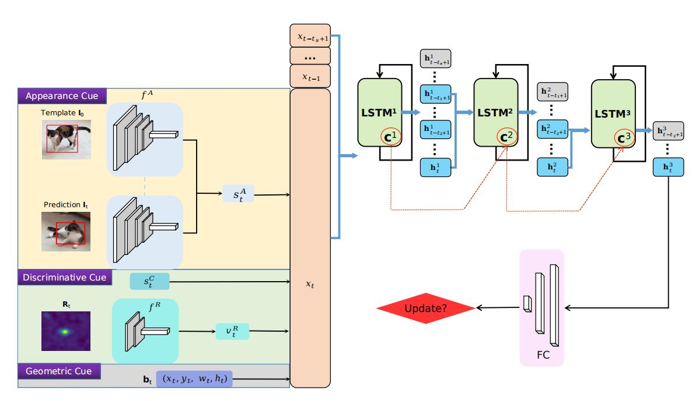

# LTMU
- High-Performance Long-Term Tracking with Meta-Updater(**CVPR2020 Oral && Best Paper Nomination**).



## Introduction 
Our Meta-updater can be easily embedded into other online-update algorithms(Dimp, ATOM, ECO, RT-MDNet...) to make their online-update more accurately in long-term tracking task. [More info](https://zhuanlan.zhihu.com/p/130322874).
## Experiments
**+MU = Basetracker+Meta-Updater**

**+LTMU = Basetracker+Meta-Updater+Global Detection+Verifier+Bbox refine**
| Tracker            | LaSOT(AUC)    | VOT2020 LT(F) | VOT2018 LT(F) | TLP(AUC) |Link|
|:-----------:|:----------------:|:----------------:|:----------------:|:----------------:|:----------------:|
| [**RT-MDNet**](https://github.com/IlchaeJung/RT-MDNet)| 0.335               |0.338             |0.367             |0.276             |Paper/[Code](https://github.com/IlchaeJung/RT-MDNet)/[Results](https://drive.google.com/file/d/1cZOdhhlR59sOSqRdKSfRZ6YelUvp8pF5/view?usp=sharing)|
| [**RT-MDNet+MU**](https://github.com/Daikenan/LTMU/tree/master/RTMD_MU)| 0.354               |0.396             |0.407             |0.337             |Paper/[Code](https://github.com/Daikenan/LTMU/tree/master/RTMD_MU)/[Results](https://drive.google.com/file/d/1pwwh4SQZ6bSfEN_vOYYMrvo0uUzBC015/view?usp=sharing)|
| [**ATOM**](https://github.com/visionml/pytracking)| 0.511               |0.497             |0.510             |0.399             |Paper/[Code](https://github.com/visionml/pytracking)/[Results](https://drive.google.com/file/d/1ZhtBjKqrkWiTpCd8pt9os3Jl_vVJV_zV/view?usp=sharing)|
| [**ATOM+MU**](https://github.com/Daikenan/LTMU/tree/master/ATOM_MU)    | 0.541               |0.620             |0.628             |0.473             |Paper/[Code](https://github.com/Daikenan/LTMU/tree/master/ATOM_MU)/[Results](https://drive.google.com/file/d/1OKYwtywT5moGjtc-1-xOLHZqEi9nt6Bu/view?usp=sharing)|
| [**DiMP**](https://github.com/visionml/pytracking)| 0.578               |0.573             |0.587             |0.514             |Paper/[Code](https://github.com/visionml/pytracking)/[Results](https://drive.google.com/file/d/1gJKjuqW3VMEW7190xC_06S4lAJGpkega/view?usp=sharing)|
| [**DiMP+MU**](https://github.com/Daikenan/LTMU/tree/master/DiMP_MU)    | 0.602               |0.641             |0.649             |0.564             |Paper/[Code](https://github.com/Daikenan/LTMU/tree/master/DiMP_MU)/[Results](https://drive.google.com/file/d/15gjx9HXQC64l09GsTGUxWq1NAb3N_URy/view?usp=sharing)|
| [**DiMP+LTMU**](https://github.com/Daikenan/LTMU/tree/master/DiMP_LTMU)    | 0.605               |0.691             |-             |0.572             |Paper/[Code](https://github.com/Daikenan/LTMU/tree/master/DiMP_LTMU)/[Results](https://drive.google.com/file/d/12ufrxmdpIUM4YTbBK91bHZvlQ9kG1aEZ/view?usp=sharing)|
| [**PrDiMP**](https://github.com/visionml/pytracking)| 0.612               |0.632             |0.631             |0.535             |Paper/[Code](https://github.com/visionml/pytracking)/[Results](https://drive.google.com/file/d/1dCha10-ENvcEQpZDMwpnO-Bfbb0gfZdi/view?usp=sharing)|
| [**PrDiMP+MU**](https://github.com/Daikenan/LTMU/tree/master/PrDiMP_MU)  | 0.615               |0.661             |0.675             |0.582             |Paper/[Code](https://github.com/Daikenan/LTMU/tree/master/PrDiMP_MU)/[Results](https://drive.google.com/file/d/1bU1-qQd0P9NRndsnEBIeXXU4kkmn1gtT/view?usp=sharing)|
| [**SuperDiMP**](https://github.com/visionml/pytracking)| 0.646               |0.647             |0.667             |0.552             |Paper/[Code](https://github.com/visionml/pytracking)/[Results](https://drive.google.com/file/d/1P8E0oRXGM_-hneYU_QTz1Gpl4LjAg5tj/view?usp=sharing)|
| [**SuperDiMP+MU**](https://github.com/Daikenan/LTMU/tree/master/Super_DiMP_MU)| 0.658               |0.704             |0.707             |0.595             |Paper/[Code](https://github.com/Daikenan/LTMU/tree/master/Super_DiMP_MU)/[Results](https://drive.google.com/file/d/1Mejp1JXcStZYa9NcoE9BaiEwaEEVlVJr/view?usp=sharing)|
| [**D3S**](https://github.com/alanlukezic/d3s)        |     0.494               |0.437                 |0.445                 |0.390                 |Paper/[Code](https://github.com/alanlukezic/d3)/[Results](https://drive.google.com/file/d/1GATY6GgUBCljAZyvBfViQsA3Cbg6aeeR/view?usp=sharing)|
| [**D3S+MU**](https://github.com/Daikenan/LTMU/tree/master/D3S_MU)     |       0.520             |0.518                 |0.534                 |0.413                 |Paper/[Code](https://github.com/Daikenan/LTMU/tree/master/D3S_MU)/[Results](https://drive.google.com/file/d/1Tm4dWyGdyHo81CyfDPkTcl5-R9m0Z8c_/view?usp=sharing)|
| [**ECO**](https://github.com/visionml/pytracking)        | -                   |-                 |-                 |-                 |Paper/Code/Results|
| **ECO+MU**     | -                   |-                 |-                 |-                 |Paper/Code/Results|
| [**MDNet**](https://github.com/hyeonseobnam/py-MDNet)        | -                   |-                 |-                 |-                 |Paper/Code/Results|
| **MDNet+MU**     | -                   |-                 |-                 |-                 |Paper/Code/Results|

## Paper link
- [Google Drive](https://drive.google.com/open?id=14CGBaVl8sNIYRi0tQ5E_wsjpHiINu9Jk)
- [Baidu Yun](https://pan.baidu.com/s/1jhPOdYoNRVD30Mr5okkv2g)   提取码：kexg
## Citation
Please cite the above publication if you use the code or compare with the LTMU tracker in your work. Bibtex entry:
```
@inproceedings{Dai_2020_CVPR,
author = {Kenan Dai, Yunhua Zhang, Dong Wang, Jianhua Li, Huchuan Lu, Xiaoyun Yang},
title = {{High-Performance Long-Term Tracking with Meta-Updater},
booktitle = {CVPR},
year = {2020}
}
```
## Results
### LTMU
- [LaSOT](https://drive.google.com/open?id=1sfNUgUcjb29-RkjA1buv7eAziEOn5ece)
- [OxUvALT](https://drive.google.com/open?id=1dAyYSpAJhMd6mFE2uRPblCwkciuA2fUf)
- [TLP](https://drive.google.com/open?id=1Heg_Pwv021pl47ekHM40H1H2tn3KjF4I)
- [VOTLT(18&19)](https://drive.google.com/open?id=1Wh4MTEavqUs4FZtH7jGJQsdSAR0ThdeA)

